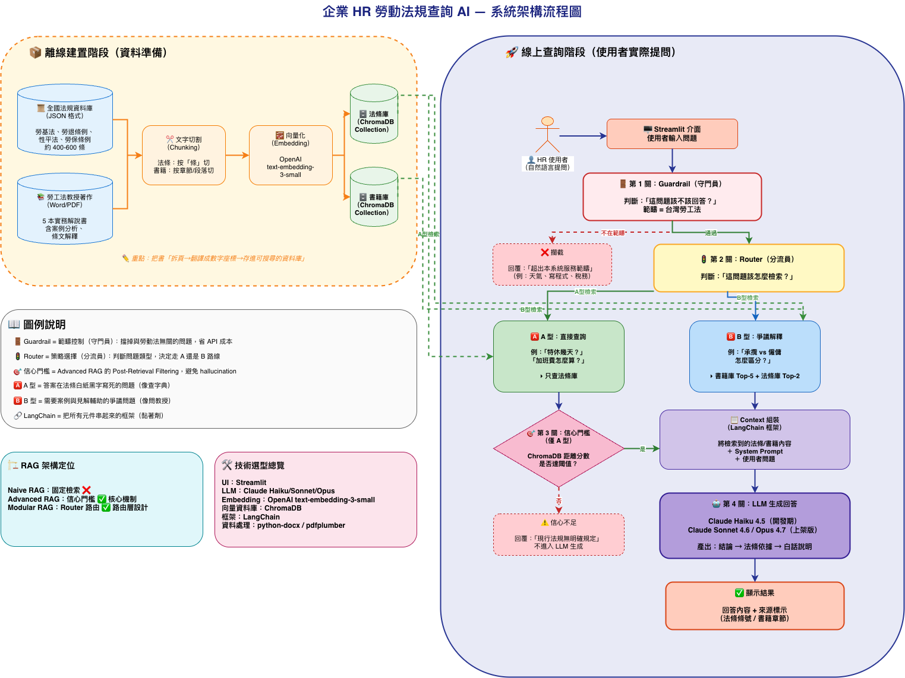

# 企業HR勞動法規查詢AI

> RAG-Based Legal Information System for Taiwan Labor Law

以 RAG（Retrieval-Augmented Generation）技術為核心，結合全國法規資料庫與勞工法教授著作，提供企業 HR 人員自然語言勞工法規查詢服務。

---

## 系統畫面

```
┌─────────────────────────────────────────────────────────┐
│  ⚖️ 企業HR勞動法規查詢AI          RAG-Based Legal...  系統資訊 │
├──────────────────┬──────────────────────────────────────┤
│  查詢流程        │                                       │
│                  │     您好，我是HR勞動法規查詢AI         │
│  1 Guardrail     │                                       │
│  2 Router        │  特休假幾天？計算方式是什麼？          │
│  3 檢索          │  加班費如何計算？                      │
│  4 信心門檻      │  承攬跟僱傭關係怎麼區分？              │
│  5 LLM 生成      │  雇主可以單方面調降薪資嗎？            │
│                  │                                       │
│  資料來源        ├──────────────────────────────────────┤
│  法條庫 / 書籍庫 │  請輸入勞工法規問題...          [送出] │
└──────────────────┴──────────────────────────────────────┘
```

---

## 功能特色

- **自然語言提問**：直接用中文問，不需要輸入關鍵字
- **雙層保護機制**：Guardrail 過濾範疇外問題，避免 API 浪費
- **智慧路由**：自動判斷問題類型，選擇最適合的檢索策略
- **來源可追溯**：每個回答都附上引用的法條條號或書籍章節
- **完全免費**：使用 Groq 免費 API + sentence-transformers 本地 Embedding

---

## RAG 架構說明



> [點此開啟互動版架構圖](https://viewer.diagrams.net/?url=https://raw.githubusercontent.com/Chenche0119/hr-labor-law-rag/main/static/architecture.drawio)

### 問題類型說明

| 類型 | 定義 | 範例 | 檢索策略 |
|------|------|------|---------|
| A 直接查詢型 | 問特定法條、數字、明確規定 | 「特休幾天？」「加班費怎麼算？」 | 只查法條庫，套用信心門檻 |
| B 爭議解釋型 | 問模糊地帶、實務見解、身份界定 | 「承攬與僱傭如何區分？」 | 書籍庫 Top-5 + 法條庫 Top-2 |

---

## 技術選用

| 模組 | 技術 | 說明 |
|------|------|------|
| 前端 | 原生 HTML / CSS / JavaScript | 單頁應用，無需框架 |
| 後端 | Flask 3.0 | 輕量 Python Web 框架 |
| LLM | Groq API（llama-3.3-70b） | **免費**，速度快 |
| Embedding | sentence-transformers（本地） | **免費**，支援中文多語言 |
| 向量資料庫 | ChromaDB | 本地持久化儲存 |
| Embedding 模型 | paraphrase-multilingual-MiniLM-L12-v2 | 多語言，約 500MB |

---

## 資料來源

### 法條庫（280 條）

從[全國法規資料庫](https://law.moj.gov.tw)自動下載：

| 法規名稱 | 條數 |
|---------|------|
| 勞動基準法 | 86 條 |
| 勞工退休金條例 | 58 條 |
| 性別平等工作法 | 45 條 |
| 勞工保險條例 | 91 條 |

### 書籍庫（需自行準備）

將勞工法教授著作（`.docx` 或 `.pdf` 格式）放入 `data/books/` 目錄，執行 `process_books.py` 後自動切割入庫。

---

## 快速開始

### 前置需求

- Python 3.11+
- [uv](https://docs.astral.sh/uv/)（建議）或 pip
- [Groq API Key](https://console.groq.com)（免費註冊）

### 安裝步驟

**1. 取得專案**

```bash
git clone https://github.com/Chenche0119/hr-labor-law-rag.git
cd hr-labor-law-rag
```

**2. 建立虛擬環境並安裝依賴**

```bash
uv venv .venv
source .venv/bin/activate      # Windows: .venv\Scripts\activate
uv pip install -r requirements.txt
```

> 首次執行時 sentence-transformers 會自動下載模型（約 500MB），需要網路連線。

**3. 設定 API Key**

前往 [console.groq.com](https://console.groq.com) 免費註冊並取得 API Key，然後：

```bash
cp .env.example .env
# 用任意編輯器開啟 .env，填入你的 Key：
# GROQ_API_KEY=gsk_xxxxxxxxxxxxxxxxxxxx
```

**4. 下載法條並建立向量索引**

```bash
# 下載 4 部勞工法規（約 10 秒）
python scripts/download_laws.py

# 建立 ChromaDB 向量索引（首次約 1~2 分鐘）
python scripts/build_index.py
```

**5. 啟動系統**

```bash
python server.py
```

開啟瀏覽器前往 **http://localhost:5001**

---

## 書籍資料建置（選用）

若有勞工法教授著作（.docx 或 .pdf），可加入書籍庫以提升 B 型問題的回答品質：

```bash
# 1. 將書籍檔案放入 data/books/ 目錄
cp your_book.docx data/books/

# 2. 處理並切割成 chunk
python scripts/process_books.py

# 3. 重新建立向量索引
python scripts/build_index.py
```

---

## 專案結構

```
hr-labor-law-rag/
├── server.py                  # Flask 後端（/api/query、/api/health）
├── app.py                     # Streamlit 版本（備用）
├── requirements.txt
├── .env.example               # API Key 範本
├── static/
│   └── index.html             # 單頁 HTML 前端
├── src/
│   └── rag_engine.py          # 核心 RAG 引擎
│                              #   Guardrail → Router → 檢索 → LLM
├── scripts/
│   ├── download_laws.py       # 爬取全國法規資料庫
│   ├── process_books.py       # 處理書籍 Word/PDF
│   └── build_index.py         # 建立 ChromaDB 向量索引
├── eval/
│   └── evaluation.py          # 評估腳本
└── data/
    ├── laws/                  # 法條 JSON（自動產生）
    └── books/                 # 書籍原始檔（手動放入）
```

---

## API 說明

### `POST /api/query`

```json
// Request
{ "question": "特休假幾天？" }

// Response
{
  "answer": "結論：特休假天數根據...",
  "query_type": "A",
  "query_type_label": "直接查詢型（法條庫）",
  "guardrail_passed": true,
  "chunks": [
    {
      "source": "勞動基準法第38條",
      "content": "第38條 勞工在同一雇主...",
      "distance": 0.3947,
      "collection": "laws"
    }
  ]
}
```

### `GET /api/health`

```json
{ "status": "ok" }
```

---

## 執行評估

```bash
python eval/evaluation.py
```

評估內容：

| 評估項目 | 題數 | 指標 |
|---------|------|------|
| Guardrail 攔截準確率 | 10 題（範疇外） | 正確攔截數 / 10 |
| Guardrail 放行準確率 | 25 題（範疇內） | 正確放行數 / 25 |
| Router A 型準確率 | 10 題 | 正確分類數 / 10 |
| Router B 型準確率 | 10 題 | 正確分類數 / 10 |

結果輸出至 `eval/eval_results.json`。

---

## 組員分工

| 姓名 | 職責 |
|------|------|
| 林仰恩 | |
| 陳姿吟 | |
| 許文晴 | |
| 林昀蓁 | |
| 吳秉彥 | |

---

## 注意事項

- 本系統提供法規資訊查詢，**不構成正式法律意見**。
- 法條內容來源為全國法規資料庫，以最新公布版本為準。
- `data/laws/`、`chroma_db/`、`.env` 不納入版本控制。
